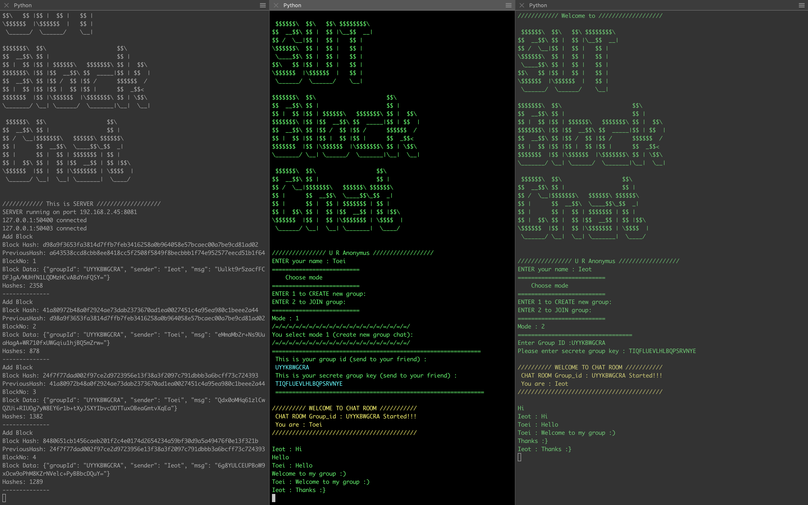

# BlockChain ChatApp (SUT BlockChat)

## Getting Start MacOs
1. install python 3  
[Download](https://www.python.org/download/releases/3.0/)
2. install pip
3. uninstall pyCrpto (if exist)  
`/Library/Frameworks/Python.framework/Versions/3.8/bin/pip3 uninstall pycrypto`  
or  
`pip3 uninstall pycrypto`  
4. Install pycryptodome
`/Library/Frameworks/Python.framework/Versions/3.8/bin/pip3 install pycryptodome`  

## Getting Start Window
1. Install python 3 
[Download](https://www.python.org/download/releases/3.0/)
2. Make sure you use python v. >3.0 by `python --version`
3. Upgrade pip `python -m pip install --upgrade pip`
4. Install module pycryptodome `pip install pycryptodome`  
   uninstall pycrypto if exist `pip uninstall pycrypto`
5. Install module colorama `pip install colorama`

## Start Program
  - **START SERVER command** 
`python ChatApp.py <port>` 
`python ChatApp.py 8081` 
  - **START CLIENT with ip** 
`python ChatApp.py <ip> <port>` 
Ex.
`python ChatApp.py localhost 8081`
  - **You can run with** 
`python <YOUR_PATH_To_PROJECT>/ChatApp.py <ip> <port>` 
Ex. 
`python Documents/GitHub/BlockChainChatApp/ChatApp.py 8081`
# Screen shot

